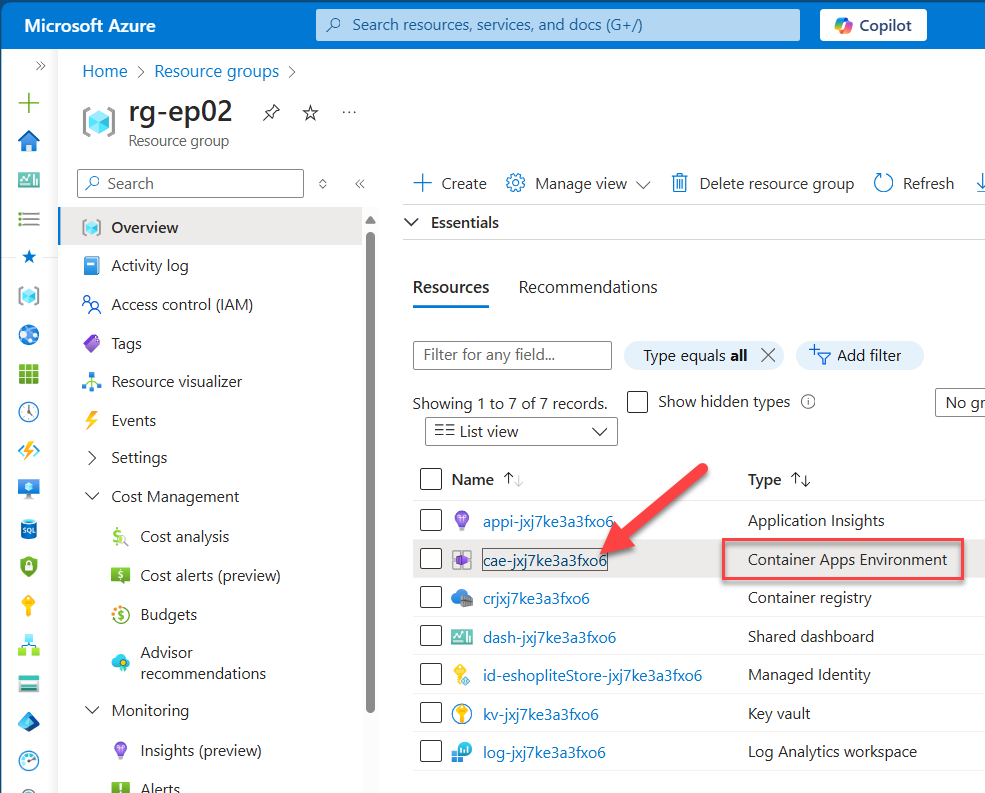
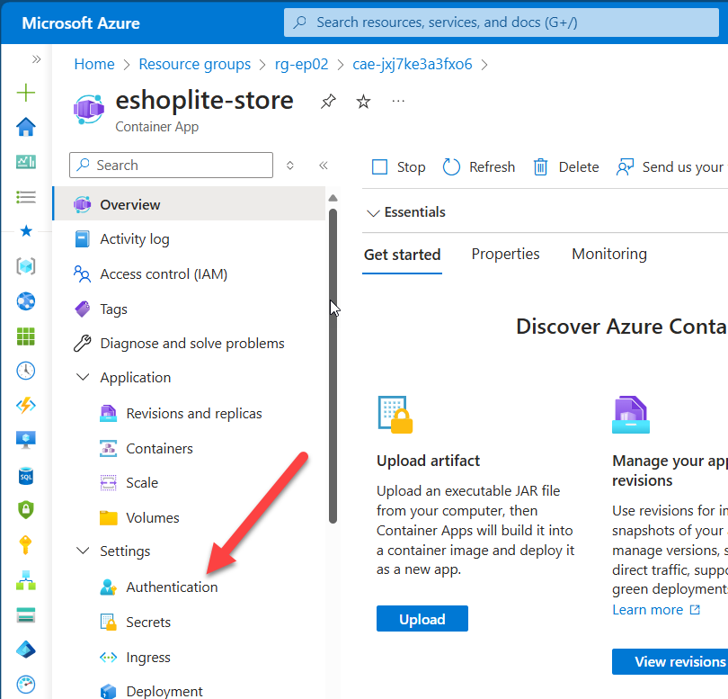
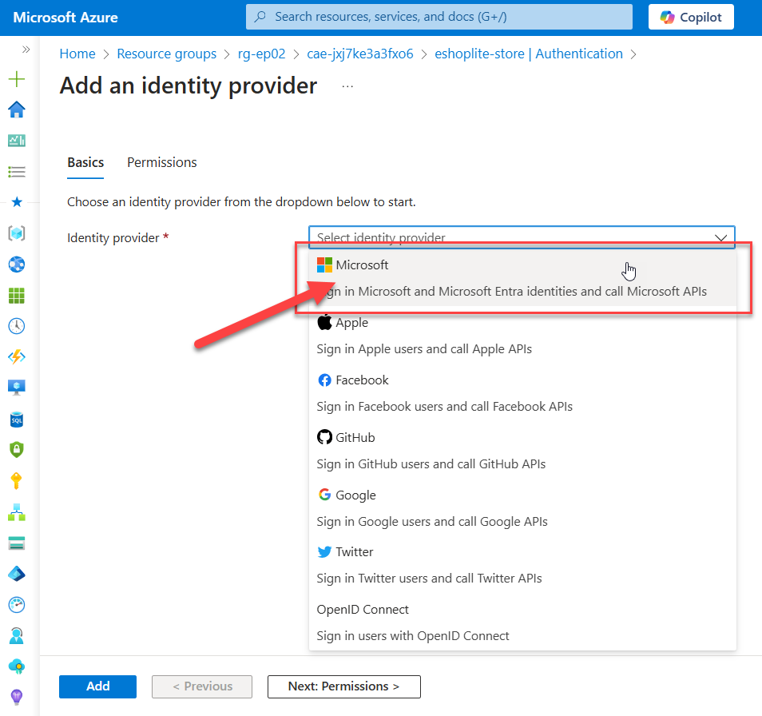
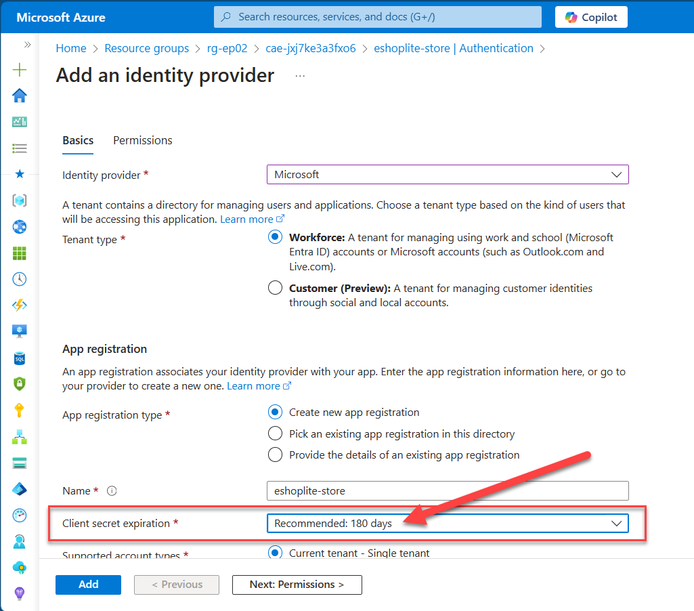
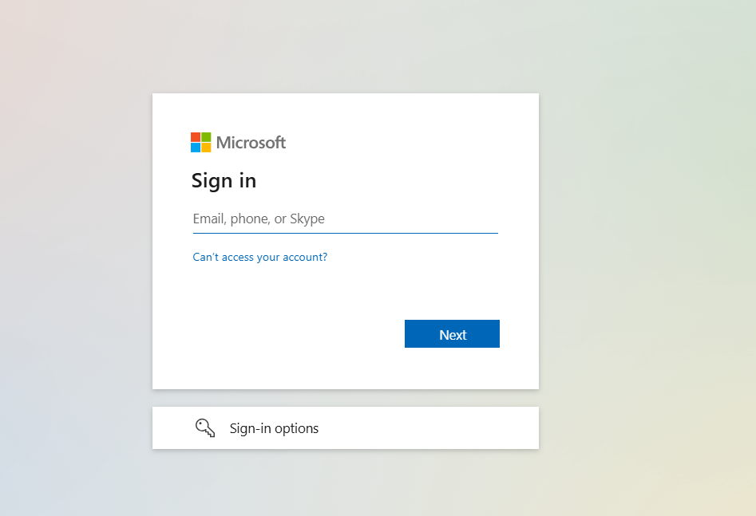

# Authenticating an application on ACA without changing codes

You don't need to change a single line of code to secure your application deployed on [Azure Container Apps (ACA)](https://learn.microsoft.com/azure/container-apps/overview)! Instead, your application is automatically protected simply by enabling the authentication feature, called called EasyAuth.

Let's see how you can do it with a few mouse clicks!

## Prerequisites

In this chapter, we will be using the app deployed in the [previous chapter](../2-monolith-on-aca/). Note that no code needs to be changed to add this authentication feature.

## Add authentication in a few clicks

The app is now deployed, but it does not have authentication enabled. Navigate to the [Azure Portal](https://portal.azure.com/), and find the Resource Group you just deployed (e.g., rg-ep02). In this resource group, open the **Container Apps Environment**.



From there, select the Container App named **eshoplite-store**.


From the left menu, select **Authentication** and click **Add identity provider**.



You can choose between multiple providers, but let's use Microsoft since it's deployed in Azure and you are already logged in.



Once Microsoft is chosen, you will see many configuration options. Select the recommended client secret expiration (e.g., 180 days).



You can keep all the other default settings. Click **Add**. After a few seconds, you should see a notification in the top right corner that the identity provider was added successfully.

Voila! Your app now has authentication.

Next time you navigate to the app, you will be prompted to log in with your Microsoft account. Notice that your entire app is protected. No page is accessible without authentication.



The first time you log in, you will see a Permissions requested screen. Note that it is **eshoplite-store**, check the **Consent** checkbox, and click **Accept(()).


## Built-in Authentication on ACA

The built-in authentication feature of ACA is a simple and powerful way to add authentication your applications with minimal effort. Here are some key points to remember:

- You don't need to change the existing app code to add this authentication feature.
- This built-in authentication feature of ACA protects your entire application, not individual pages.

For more details about the built-in authentication feature of ACA, see [Authentication and authorization in Azure Container Apps](https://learn.microsoft.com/azure/container-apps/authentication).

## Optional Learning

- [Extend the authentication and authorization feature for Azure Container Apps](../3-opt-fine-grained-auth/README.md)
- [Authentication and authorization in Azure Container Apps](https://learn.microsoft.com/azure/container-apps/authentication)
- [Enable authentication and authorization in Azure Container Apps with Microsoft Entra ID](https://learn.microsoft.com/azure/container-apps/authentication-entra)

## Clean up the deployed resources

You are running in Azure and depending on your subscription may be incurring costs. Run the following command to delete everything you have provisioned. (But if you plan on going right to Chapter 3.1 you can skip this part!)

```bash
azd down --force --purge
```

## Up next

It's *choose your own adventure* time!

You can learn how to opt-out some pages from authentication.

👉 [Chapter 3.1 - Fine-grained authenticaiton](../3-opt-fine-grained-auth/)

... or ...

Learn how to refactor the monolith app down into microservices and deploy all of them to ACA. 

👉 [Chapter 4: Refactoring to microservices](../4-microservices/)

