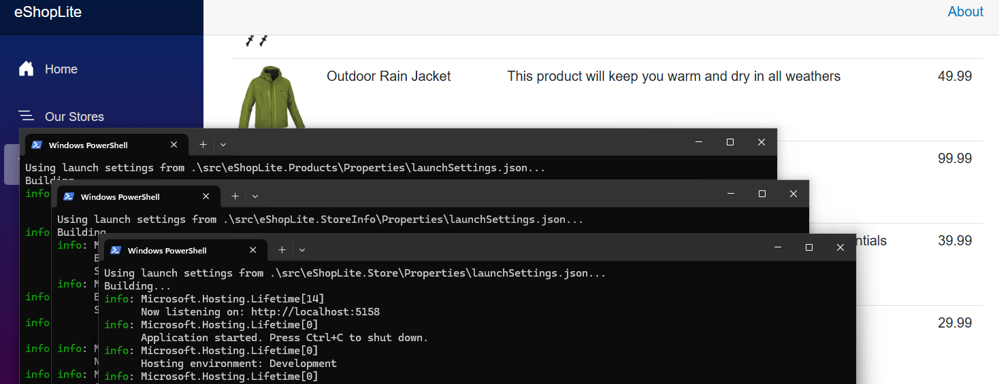
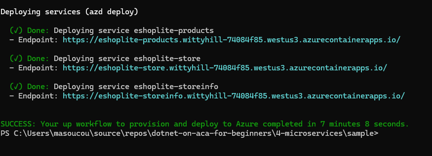
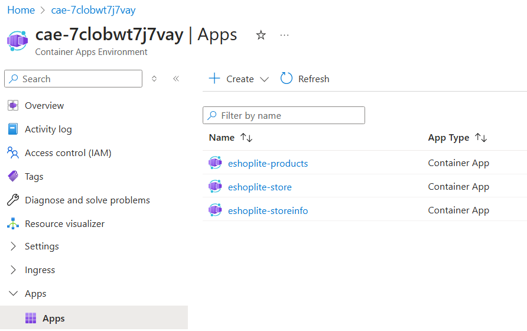
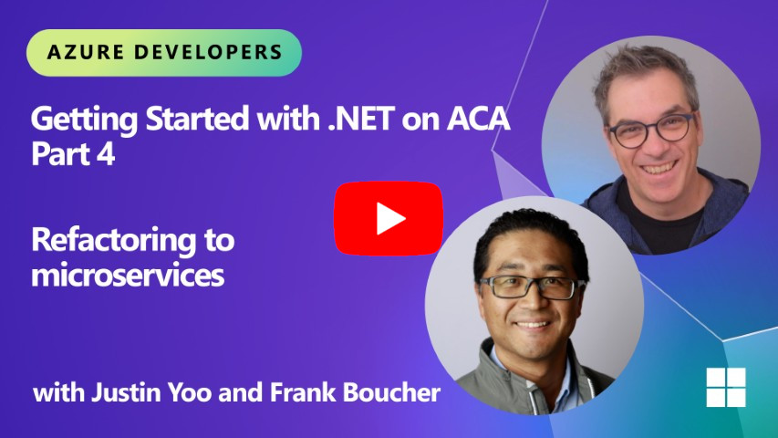

# Refactoring to microservices

You've seen how you can run a monolith app in a container and deploy it to Azure Container Apps. In this chapter you'll learn how to refactor the monolith app into microservices and deploy them to Azure Container Apps.

## Prerequisites

To run this sample app, make sure you have all the [prerequisites](../README.md#prerequisites).

## Quick tour of the microservices architecture

One of the organizing principles of microservices is to break down a monolith into smaller, more manageable services. Each service should be responsible for a specific business capability and should be independently deployable. This allows for better scalability, maintainability, and flexibility in the development process.

We will split up our monolith app into four smaller projects (you can find all the code in the [sample directory](./sample/src/)):

- `eShopLite.Store`: This has the same name as the monolith did, but now only contains the front-end components. It still is capable of calling the newly split out web APIs for products and store info.
- `eShopLite.Products`: New web API project where the product API and databases are hosted
- `eShopLite.StoreInfo`: New web API project where the individual retail store info API and databases are hosted
- `eShopLite.DataEntities`: New class library project for the data entities - this project is referenced from all of the other projects.

## Getting Started

### Get the repository root

> 📝**NOTE:**
> 
> To simplify the copy paste of the commands that sometimes require an absolute path, we will be using the variable `REPOSITORY_ROOT` to keep the path of the root folder where you cloned/downloaded this repository. The command `git rev-parse --show-toplevel` returns that path.

If you're running on a linux or Mac-based machine or are using bash, run the following:

```bash
# bash/zsh
REPOSITORY_ROOT=$(git rev-parse --show-toplevel)
```

Otherwise if you are using Windows and PowerShell, run this:

```powershell
# PowerShell
$REPOSITORY_ROOT = git rev-parse --show-toplevel
```

### Run all the microservics locally

Our end goal is to containerize all of these applications and deploy them to Azure Container Apps. But before we do that, let's run them locally to make sure everything is working as expected.

To build and run this entire solution on your local machine, run the following commands in your terminal.

1. Change to the current sample's directory.

    ```bash
    cd $REPOSITORY_ROOT/4-microservices/sample
    ```

1. Build the solution.

    ```bash
    dotnet restore && dotnet build
    ```

1. From the command line it can be a pain to start 3 projects individually. To make things easier, you can copy/paste one of these 2 scripts to help you.

    **PowerShell**
    ```powershell
    Start-Process powershell -ArgumentList "dotnet run --project ./src/eShopLite.Products"
    Start-Process powershell -ArgumentList "dotnet run --project ./src/eShopLite.StoreInfo"
    Start-Process powershell -ArgumentList "dotnet watch run --project ./src/eShopLite.Store"
    ```

    > 📝**NOTE:** You'll probabably get a warning asking you if you want to paste multiple lines at once, just click yes. 
    >
    > Also don't forget to hit **ENTER** after the last line in the original terminal window to run the last command.

    **Bash**
    ```bash
    dotnet run --project ./src/eShopLite.Products &
    dotnet run --project ./src/eShopLite.StoreInfo &
    dotnet watch run --project ./src/eShopLite.Store &
    ```

1. A browser should open and display `http:localhost:5158`, if it doesn't, go ahead and navigate there. You should see the main eShopLite front-end website. And if you click on **Our Stores** or **Products** from the navigation menu, it will load the respective data from the microservices.

    

## Containerizing the microservices

We've created 3 Dockerfiles for you that take care of containerizing its respective microservice application: **Dockerfile.products**, **Dockerfile.storeinfo** and **Dockerfile.store**. 

### Exploring the Dockerfiles

The Docker files are located directly under the `/sample` directory.

Open up any one of the Dockerfiles. You'll see that it copies both its own project and the **eShopLite.DataEntities** project to the container. This is because each top-level microservice projects depend on **eShopLite.DataEntities** project.

Here's a sample from the **Dockerfile.products** file:

```dockerfile
...

FROM mcr.microsoft.com/dotnet/sdk:9.0-alpine AS build

COPY ./src/eShopLite.Products /source/eShopLite.Products
COPY ./src/eShopLite.DataEntities /source/eShopLite.DataEntities
# any other project dependencies would be listed here as well

...
```

Another interesting thing to note is the **Dockerfile.storeinfo** and **Dockerfile.products** both create an empty file that will eventually hold their respective SQLite database.

```dockerfile

...

RUN touch /app/StoreInfo.db
# or RUN touch /app/Products.db for the Dockerfile.products

...

```

The rest of the Dockerfile is pretty standard. It builds the project and specifies and entrypoint to the applications.

## Deploying to ACA via azd

Our next steps then to get our refactored eShopLite microservice-based application out into world is to deploy it to Azure Container Apps. We'll use the Azure Developer CLI (azd) to do this.

### Initializing the solution for azd

1. Make sure that you're in this chapter's sample directory.

    ```bash
    cd $REPOSITORY_ROOT/4-microservices/sample
    ```

1. Initialize the Azure Developer CLI (azd) with the following command:

    ```bash
    azd init
    ```

1. You'll be prompted **How do you want to initialize your app?** 

    > Choose **Use code in the current directory**. 

1. azd will scan the directory and find projects that are available to deploy. Once it completes its scan you should see output similar to the following:

    ```bash
    azd will generate the files necessary to host your app on Azure using Azure Container Apps.
    ```

    > Select **Confirm and continue initializing my app**.

1. You'll now be asked to provide the environment name. This can be whatever you want and serves as a unique identifier for a specific deployment. It's also used to prefix all the Azure resources created as part of your deployment.

  > 📝**NOTE:**
  > Pick a different name than you did in the second chapter. This is just to be safe and make sure we don't run into any naming collisions.
  
1. Once the initialization is complete, there will be several new files created. One of them is named **azure.yaml** and will be found directly under the **sample** directory. We will need to update that file with the Docker settings to use Azure Container Registry remote build.

    ```yaml
    name: 4-microservices
    metadata:
      template: azd-init@1.11.0
    services:
      eshoplite-products:
        project: src/eShopLite.Products
        host: containerapp
        language: dotnet
        # 👇👇👇 Add the docker settings below
        docker:
          path: ../../Dockerfile.products
          context: ../../
          remoteBuild: true
        # 👆👆👆 Add the docker settings above
      eshoplite-store:
        project: src/eShopLite.Store
        host: containerapp
        language: dotnet
        # 👇👇👇 Add the docker settings below
        docker:
          path: ../../Dockerfile.store
          context: ../../
          remoteBuild: true
        # 👆👆👆 Add the docker settings above
      eshoplite-storeinfo:
        project: src/eShopLite.StoreInfo
        host: containerapp
        language: dotnet
        # 👇👇👇 Add the docker settings below
        docker:
          path: ../../Dockerfile.storeinfo
          context: ../../
          remoteBuild: true
        # 👆👆👆 Add the docker settings above
    ```

1. We need to make sure the **eShopLite.Store** frontend has the correct URLs to call both backend web APIs. The **infra/resources.bicep** lets us specify URLs for service discovery. Add the environment variables below the `eshopliteStore` module definition.

    ```bicep
    module eshopliteStore 'br/public:avm/res/app/container-app:0.8.0' = {
      name: 'eshopliteStore'
      ...
            env: union([
              {
                name: 'APPLICATIONINSIGHTS_CONNECTION_STRING'
                value: monitoring.outputs.applicationInsightsConnectionString
              }
              {
                name: 'AZURE_CLIENT_ID'
                value: eshopliteStoreIdentity.outputs.clientId
              }
              {
                name: 'PORT'
                value: '8080'
              }
              // 👇👇👇 Add the environment variables below
              {
                name: 'ProductsApi'
                value: 'https://${eshopliteProducts.outputs.fqdn}'
              }
              {
                name: 'StoreInfoApi'
                value: 'https://${eshopliteStoreinfo.outputs.fqdn}'
              }
              // 👆👆👆 Add the environment variables above
            ],
      ...
    }
    ```

1. Provision and deploy the microservice apps to ACA.

    ```bash
    azd up
    ```

   > While executing this command, you'll be asked to provide the Azure subscription ID and location.

1. It may take several minutes, but eventually you will get a message that all the resources have been deployed.

  

1. Open your web browser and navigate to the URL indicated for **eshop-store** in the output. You should see the eShopLite frontend running in Azure Container Apps.

1. If you browse to the Azure portal and open up the Container Apps Environment that was created from as part of this provisioning process, you will see all 3 microservice applications.

  

## Clean up the deployed resources

You are running in Azure and depending on your subscription may be incurring costs. Run the following command to delete everything you just provisioned.

```bash
azd down --force --purge
```

### Video

[](https://www.youtube.com/watch?v=3zhm0ZFnNYc&list=PLI7iePan8aH6jQxDupYUvgQsP3G7WGM0b&index=4)

## Up next

Every time you make a change to your application, you could run `azd up` to redeploy it. That would work, but it would be better if you had a CI/CD pipeline that would automatically redeploy for you, and that's what we'll learn about in the next chapter.

👉[CI/CD with GitHub Actions](../5-cicd/README.md)
