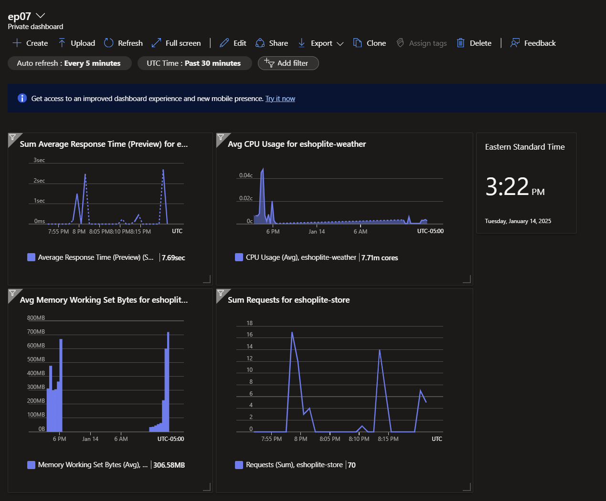
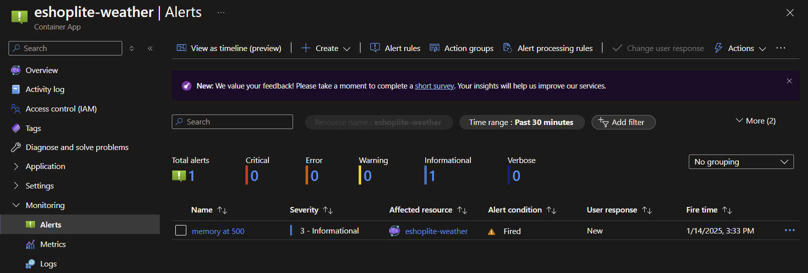

# Monitoring ACA

Azure Container Apps provides several built-in observability features that together give you a great view of your container app’s health. In this chapter, we will do a quick tour of the monitoring capabilities of Azure Container Apps.

## Getting Started

You can reuse the code and deployed solution from the previous chapter, but this version of the app has some additional logging and metrics to showcase the monitoring capabilities.

By now we'll assume you're a pro at deploying ACA apps with azd, so we'll be brief with the instructions.

1. Get the repository root

	To simplify the copy paste of the commands that sometimes required an absolute path, we will be using the variable `REPOSITORY_ROOT` to keep the path of the root folder where you cloned/ downloaded this repository. The command `git rev-parse --show-toplevel` returns that path.

	```bash
	# Bash/Zsh
	REPOSITORY_ROOT=$(git rev-parse --show-toplevel)
	```

	```powershell
	# PowerShell
	$REPOSITORY_ROOT = git rev-parse --show-toplevel
	```

1. Move to the **7-monitoring/sample** directory.

    ```bash
    cd $REPOSITORY_ROOT/7-monitoring/sample
    ```

1. Initialize the Azure Developer CLI (azd) in the current directory.

    ```bash
    azd init
    ```

1. Provision and deploy the microservice apps to ACA.

    ```bash
    azd up
    ```

1. Open the browser and navigate to the deployed app to validate that it's working as expected.

   > 📝 **Note**
   > You may feel some delay in the response of the Product service, it's purposely added to simulate a slow response.
 

## Exploring the Monitoring Capabilities in Azure Container Apps

Azure Container Apps provides several built-in observability features that are available directly from the Azure portal. Let's explore them.

1. Open the Azure portal and navigate to the Azure Container Apps resource.
1. In the left-hand menu, under **Monitoring**, you will find the following options:
	- **Metrics**: View metrics for your container app.
	- **Logs**: View logs for your container app.
	- **Alerts**: Set up alerts for your container app.
	- **Diagnostics settings**: Configure diagnostic settings for your container app.
	- **Activity log**: View the activity log for your container app.
	- **Insights**: View insights for your container app.

### Creating a Dashboard to visualize the metrics

From the Azure portal, on the Azure Container Apps resource, you can visualize many metrics, but only one at the time and only for the current Container App. To have a better overview of different metrics covering multiple container Apps, you can create a dashboard.

1. From the Azure portal, navigate to the **eshoplite-store** Azure Container Apps resource.
1. In the left-hand menu, under Monitoring, select **Metrics**.
1. Click on **Add metric** and select **Average Response Time** as Metric, and **Avg** as Aggregation.
1. Click on **Save to dashboard**, **Pin to dashboard** and select **Create new**.
1. Give the dashboard a name, for example, **chapter-7**. Then click on the **Create and pin** button.

Let's create two more metrics but from the **store-info** container app.

1. From the Azure portal, navigate to the **eshoplite-storeinfo** Azure Container Apps resource.
1. In the left-hand menu, under Monitoring, select **Metrics**.
1. Click on **Add metric** and select **CPU usage** as Metric, and **Avg** as Aggregation.
1. Click on **Save to dashboard**, **Pin to dashboard** and select **chapter-7** dashboard.
1. Click on **Add metric** and select **Memory usage** as Metric, and **Avg** as Aggregation.
1. Click on **Save to dashboard**, **Pin to dashboard** and select **chapter-7** dashboard.

Now, you can open the dashboard in a new tab and see the metrics side by side. This can be done by clicking the third icon (Dashboard) from the hamburger menu in the top left corner of the Azure portal. 

> If your dashboard is not visible, you select it from the list of dashboards, in the top left corner.



Your Dashboard is probably showing flat lines, as we haven't accessed the apps yet. Open the store webapp in a new tab and refresh the page. You should see the metrics updating in the dashboard. We will get back to it in a moment.

### Create an Alert Rule

Alert can be really useful to track important thresholds and be able to react to them. Let's create an alert rule for the store-info container app.

1. From the Azure portal, navigate to the **eshoplite-store** Azure Container Apps resource.
1. In the left-hand menu, under Monitoring, select **Alerts**.
1. Click on **Create alert rule**.
1. Select **Static** as the Threshold type.
1. Select **Memory Working Set Bytes** usage as the signal name.
1. Change the Units to **MB**.
1. Set the Threshold to **500**.
1. In the **Details** tab, give the alert a name (ex: Memory at 500).
1. Finish by clicking the **Review + create**, button.

Once created the Alert will be visible from that page (from the left-hand menu, of an ACA page, under Monitoring, select **Alerts**).



### Viewing the Logs

Azure Container Apps provides a built-in log stream that you can use to view logs for your container app. To see the logs of the container apps, follow these steps:

1. From the Azure portal, navigate to the Azure Container Apps resource.
1. In the left-hand menu, under Monitoring, select **Log stream**.
1. This will show only the logs of the current container app.
   1. You can select **Historical** as Category, and **Application** as Category to get a list of log entries comming from the app.

### Create some activities

Now that you know where to look for the metrics, logs, and alerts, let's create some activities in the app to see them in action. We baked in a few things in the app to help us with that.

- Our Stores Page
    - At each 5 clicks of the *Sort By* button, an exception will be logged. You won't notice any difference in the app, but you will see them logs of the **eshoplite-store**. Look for "5th click" in the logs.
- Our Stores Page
    - When this page is displayed a background process starts and uses in a burst CPU and Memory for about 30 sec. You will see the metrics updating in the dashboard. 
  	- The background process also generates messages into the log. Look for "Burst simulation" in the logs.
  	- By clicking 2-3 times on the **Our Stores** in the left menu, you should create enough memory usage to trigger the alert.
- Product Page
  - The response time is purposely slow (between 0.5 and 10 sec.) you will see the metrics updating in the dashboard.

Have fun exploring the monitoring capabilities of Azure Container Apps. Open side by side the web app and the Azure portal to see the metrics, the logs updating as you click through the web app.

There are many other things that you can do to monitor your application like setting up Azure Monitor and use OpenTelemetry, but that's out of the scope of this episode. In the next episode we will learn about .NET Aspire and how it does simplify the observability of our application.


## Clean up the deployed resources

To clean up the resources, run the following command:

```bash
azd down --force --purge
```

## Learn more

Learn more about all the different monitoring capabilities in [Observability in Azure Container Apps](https://learn.microsoft.com/azure/container-apps/observability). 

### Video

[](https://www.youtube.com/watch?v=ju86QG3zKHU&list=PLI7iePan8aH6jQxDupYUvgQsP3G7WGM0b&index=7)

## Up next

Now that we learn how things works let's see how we can simplify the development of microservices with .NET Aspire in that [next chapter](../8-aspire/).
