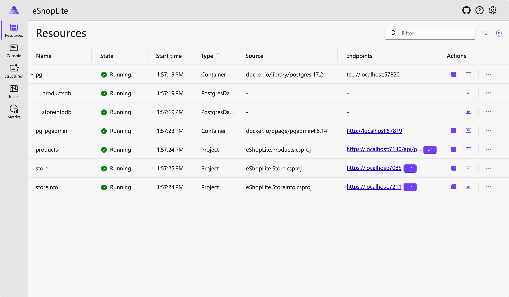
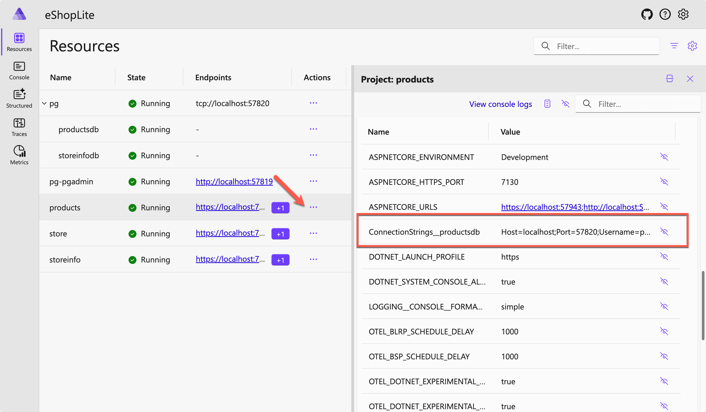
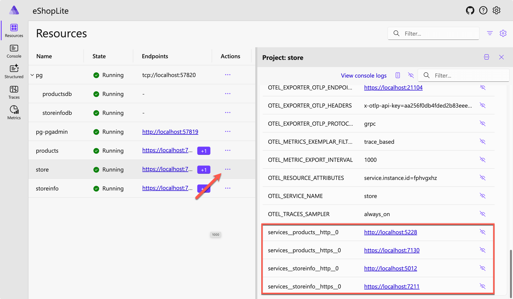

# Easier orchestration with .NET Aspire

This sample app demonstrates how to easily orchestrate MSA apps and deploy them to [Azure Container Apps (ACA)](https://learn.microsoft.com/azure/container-apps/overview), using [.NET Aspire](https://aka.ms/dotnet-aspire).

## Prerequisites

To run this sample app, make sure you have all the [prerequisites](../README.md#prerequisites).

## Getting Started

During this episode, we will introduce .NET Aspire that orchestrates the MSA apps. You will start from the [`8-aspire/sample`](./sample/) directory.

### Getting the Repository Root

To simplify the copy paste of the commands that sometimes required an absolute path, we will be using the variable `REPOSITORY_ROOT` to keep the path of the root folder where you cloned/downloaded this repository. The command `git rev-parse --show-toplevel` returns that path.

```bash
# Bazh/Zsh
REPOSITORY_ROOT=$(git rev-parse --show-toplevel)
```

```powershell
# PowerShell
$REPOSITORY_ROOT = git rev-parse --show-toplevel
```

### Running the Microservice Apps with .NET Aspire Locally

This solution has replaced the SQLite database with a containerized PostgreSQL one.

1. Make sure that Docker Desktop is running on your machine.

2. Make sure that you're in the `8-aspire/sample` directory.

    ```bash
    cd $REPOSITORY_ROOT/8-aspire/sample
    ```

3. Run the following command to build and run the applications.

    ```bash
    dotnet watch run --project ./src/eShopLite.AppHost
    ```

4. Open a browser and navigate to `https://localhost:17287` to see the .NET Aspire dashboard is up and running.

   

   As you can see the dashboard, both Products API app and StoreInfo API app now use PostgreSQL instead of SQLite.

5. Click the "View details" menu of the Products API app and see the connection string of the PostgreSQL database.

   

   And check the StoreInfo API app on the dashboard whether it's pointing to the PostgreSQL database or not.

6. Click the "View details" menu of the Store app and see the connection strings to both Product API and StoreInfo API apps.

   

7. Click the Store app link to see the app running. Then navigate to `/stores` and `/products` to see both pages are properly working.

8. To stop the apps, press `Ctrl+C` in a terminal.

### Deploying the Microservice Apps to Azure Container Apps with .NET Aspire via Azure Developer CLI (AZD)

Once you're happy with the .NET Aspire orchestration of all the microservice apps, you can deploy it to ACA through Azure Developer CLI (AZD).

1. Make sure that you're either in the `8-aspire/sample` directory.

    ```bash
    cd $REPOSITORY_ROOT/8-aspire/sample
    ```

1. You won't be able to see the `infra` directory because it's all managed by .NET Aspire. Instead, open the `azure.yaml` file and see the configurations that only contains the `eShopLite.AppHost` project.

    ```yml
    # yaml-language-server: $schema=https://raw.githubusercontent.com/Azure/azure-dev/main/schemas/v1.0/azure.yaml.json
    
    name: 8-aspire
    services:  
      app:
        language: dotnet
        project: ./src/eShopLite.AppHost/eShopLite.AppHost.csproj
        host: containerapp
    ```

1. Provision and deploy the microservice apps to ACA.

    ```bash
    azd up
    ```

   > While executing this command, you'll be asked to provide the environment name, Azure subscription ID and location.

1. Once the deployment is over, you'll see the URLs of the deployed microservice apps on the screen.

   

   Please note that not all the apps are accessible from the public internet because they have `.internal` in the URL while the Store app doesn't have it. The Store app is the only one that has external HTTP endpoints. You will also have the Aspire Dashboard URL.

1. Open your web browser and navigate to the Store app and see the app is up and running on ACA. Then navigate to `/stores` and `/products` to see both pages are properly working.

1. Navigate to the Aspire Dashboard URL to see the status of the deployed apps as well as all the connection strings that are automatically configured by .NET Aspire. Please note that you'll be asked to login to access the dashboard.

## Learn more

Curious of .NET Aspire? Here are a few resources for you to learn more:

- [.NET Aspire](https://aka.ms/dotnet-aspire)
- [Let's Learn .NET - Aspire](https://aka.ms/letslearn/dotnet/aspire)

## Clean up the deployed resources

To clean up the resources, run the following command:

```bash
azd down --force --purge
```

## Up next

It's choose your own adventure time!

You can learn how to integrate .NET Aspire with your existing .NET applications.

👉 [Chapter 8.1 - .NET Aspire integration step-by-step](../8-opt-aspire-integration/)

... or ...

Congratulations! You've completed our **.NET on Azure Container Apps for Beginners** series!
