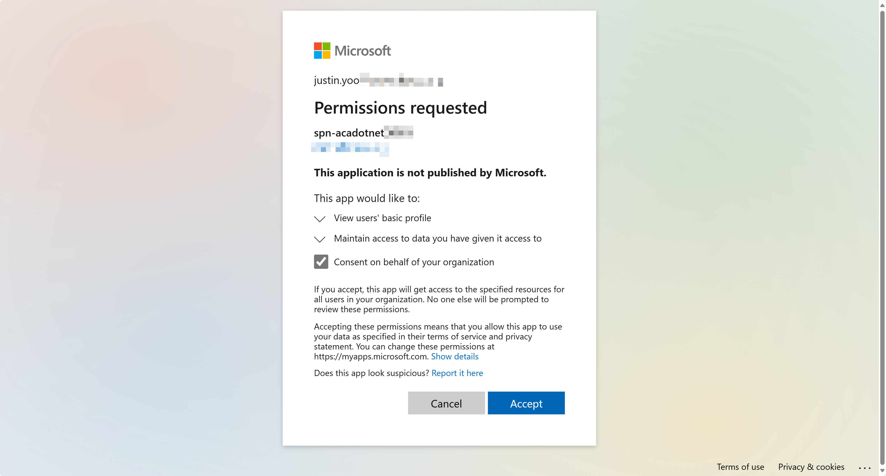

# EP03: Authenticating App on ACA

This sample app demonstrates how to add the authentication feature to [Azure Container Apps (ACA)](https://learn.microsoft.com/azure/container-apps/overview) without changing the app code.

## Prerequisites

To run this sample app, make sure you have all the [prerequisites](../README.md#prerequisites).

## Built-in Authentication on ACA

- You don't need to change the existing app code to add this authentication feature.
- Make sure that this built-in authentication feature of ACA protects your entire application, not individual pages.
- For more details about the built-in authentication feature of ACA, see [Authentication and authorization in Azure Container Apps](https://learn.microsoft.com/azure/container-apps/authentication).

## Getting Started

### Getting the Repository Root

To simplify the copy paste of the commands that sometimes required an absolute path, we will be using the variable `REPOSITORY_ROOT` to keep the path of the root folder where you cloned/ downloaded this repository. The command `git rev-parse --show-toplevel` returns that path.

```bash
# Bazh/Zsh
REPOSITORY_ROOT=$(git rev-parse --show-toplevel)
```

```powershell
# PowerShell
$REPOSITORY_ROOT = git rev-parse --show-toplevel
```

### Deploying the Monolith App to ACA via Azure Developer CLI (AZD)

Use Azure Developer CLI (AZD) to deploy the monolith app to ACA.

1. Make sure that you're in the `ep03` directory.

    ```bash
    cd $REPOSITORY_ROOT/ep03
    ```

1. Create a new environment for the app. For example, use `acadotnet` followed by a 4-digit random number.

    ```bash
    # Bash/Zsh
    azd env new "acadotnet$(($RANDOM%9000+1000))"
    ```

    ```powershell
    # PowerShell
    azd env new "acadotnet$(Get-Random -Minimum 1000 -Maximum 9999)"
    ```

1. Provision and deploy the monolith app to ACA. This will create a Microsoft Entra ID app and integrate it with ACA for the built-in authentication feature.

    ```bash
    azd up
    ```

   > While executing this command, you'll be asked to provide the Azure subscription ID and location.

1. Open your web browser and navigate to the URL provided by the ACA instance on the screen to see the monolith app running in ACA.
1. You will be redirected to the Microsoft Entra ID login page, and see the following consent page.

   

   After successful login, you will be redirected back to the monolith app.

   

## Optional Learning

- [Authentication and authorization in Azure Container Apps](https://learn.microsoft.com/azure/container-apps/authentication)
- [Enable authentication and authorization in Azure Container Apps with Microsoft Entra ID](https://learn.microsoft.com/azure/container-apps/authentication-entra)
- [Extend the authentication and authorization feature for Azure Container Apps](./extra.md)

## Clean up the deployed resources

To clean up the resources, run the following command:

```bash
azd down --force --purge
```
