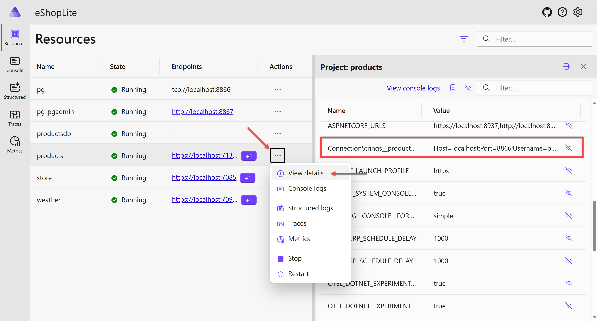
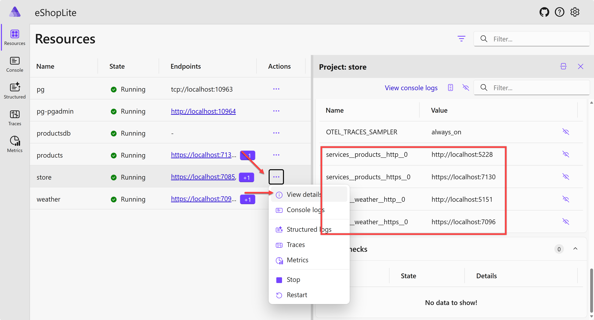
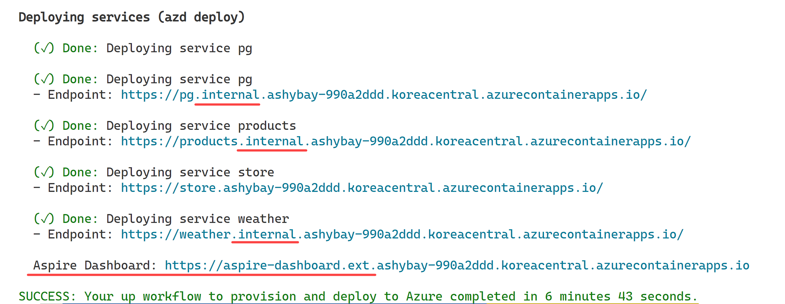

# EP08: Introduction of .NET Aspire for Easy Orchestration &ndash; EXTRA

This section is totally optional and demonstrates how [.NET Aspire](https://aka.ms/dotnet-aspire) is integrated to the existing MSA apps.

## Prerequisites

You have done and completed the [ep08](README.md) content.

### Getting the repository root

Initialize the variable `REPOSITORY_ROOT` in your preferred terminal.

```bash
# Bazh/Zsh
REPOSITORY_ROOT=$(git rev-parse --show-toplevel)
```

```powershell
# PowerShell
$REPOSITORY_ROOT = git rev-parse --show-toplevel
```

## Adding .NET Aspire to the Solution

To orchestrate all the apps without Dockerfiles or Docker Compose files, let's add [.NET Aspire](https://aka.ms/dotnet-aspire) to the solution. .NET Aspire is an orchestration tool to easily build and deploy cloud-native applications.

1. Make sure that you're in the `ep08/1_start` directory.

    ```bash
    cd $REPOSITORY_ROOT/ep08/1_start
    ```

1. Add .NET Aspire AppHost to the solution.

    ```bash
    dotnet new aspire-apphost -n eShopLite.AppHost -o src/eShopLite.AppHost
    ```

1. Add .NET Aspire ServiceDefault to the solution.

    ```bash
    dotnet new aspire-servicedefaults -n eShopLite.ServiceDefaults -o src/eShopLite.ServiceDefaults
    ```

1. Add both projects to the solution.

    ```bash
    dotnet sln add ./src/eShopLite.AppHost
    dotnet sln add ./src/eShopLite.ServiceDefaults
    ```

1. Add the following references to the `eShopLite.AppHost` project.

    ```bash
    dotnet add ./src/eShopLite.AppHost reference ./src/eShopLite.Products
    dotnet add ./src/eShopLite.AppHost reference ./src/eShopLite.Weather
    dotnet add ./src/eShopLite.AppHost reference ./src/eShopLite.Store
    ```

1. Add the the `eShopLite.ServiceDefaults` project to each app as a reference.

    ```bash
    dotnet add ./src/eShopLite.Products reference ./src/eShopLite.ServiceDefaults
    dotnet add ./src/eShopLite.Weather reference ./src/eShopLite.ServiceDefaults
    dotnet add ./src/eShopLite.Store reference ./src/eShopLite.ServiceDefaults
    ```

1. Open `src/eShopLite.AppHost/Program.cs` and add the following codes between `var builder = DistributedApplication.CreateBuilder(args);` and `builder.Build().Run();`.

    ```csharp
    var builder = DistributedApplication.CreateBuilder(args);
    
    // 👇👇👇 Add the codes below.
    
    // Add the Products API app
    var products = builder.AddProject<Projects.eShopLite_Products>("products");
    
    // Add the Weather API app
    var weather = builder.AddProject<Projects.eShopLite_Weather>("weather");
    
    // Add the Store app
    var store = builder.AddProject<Projects.eShopLite_Store>("store")
                       .WithExternalHttpEndpoints()
                       .WithReference(products)
                       .WithReference(weather)
                       .WaitFor(products)
                       .WaitFor(weather);
    
    // 👆👆👆 Add the codes above.
    
    builder.Build().Run();
    ```

1. Open `src/eShopLite.Products/Program.cs` and add the following codes.

    ```csharp
    var builder = WebApplication.CreateBuilder(args);
    
    // 👇👇👇 Add the code below.
    builder.AddServiceDefaults();
    // 👆👆👆 Add the code above.
    
    ...
    
    var app = builder.Build();
    
    // 👇👇👇 Add the code below.
    app.MapDefaultEndpoints();
    // 👆👆👆 Add the code above.
    
    ...
    
    app.Run();
    ```

1. Open `src/eShopLite.Weather/Program.cs` and `src/eShopLite.Store/Program.cs`, and do the same thing as above.

1. Open `src/eShopLite.Store/Program.cs`, find the `builder.Services.AddHttpClient<ProductApiClient>(...` line, and update it with the following code.

    ```csharp
    // Before - 👇👇👇 Remove the lines below
    builder.Services.AddHttpClient<ProductApiClient>(client =>
    {
        var productsApiUrl = builder.Configuration.GetValue<string>("ProductsApi");
        if (string.IsNullOrEmpty(productsApiUrl))
        {
            throw new ArgumentNullException(nameof(productsApiUrl), "ProductsApi configuration value is missing or empty.");
        }
        client.BaseAddress = new Uri(productsApiUrl);
    });
    
    builder.Services.AddHttpClient<WeatherApiClient>(client =>
    {
        var weatherApiUrl = builder.Configuration.GetValue<string>("WeatherApi");
        if (string.IsNullOrEmpty(weatherApiUrl))
        {
            throw new ArgumentNullException(nameof(weatherApiUrl), "WeatherApi configuration value is missing or empty.");
        }
        client.BaseAddress = new Uri(weatherApiUrl);
    });
    // Before - 👆👆👆 Remove the lines above
    
    // After - 👇👇👇 Add the lines below
    builder.Services.AddHttpClient<ProductApiClient>(client => client.BaseAddress = new Uri("https+http://products"));
    builder.Services.AddHttpClient<WeatherApiClient>(client => client.BaseAddress = new Uri("https+http://weather"));
    // After - 👆👆👆 Add the lines above
    ```

1. Open `src/eShopLite.Store/appsettings.json` and remove the `ProductsApi` and `WeatherApi` configurations.

    ```jsonc
    {
      // Remove those two lines
      "ProductsApi": "http://localhost:5228",
      "WeatherApi": "http://localhost:5151"
    }
    ```

## Replacing SQLite with PostgreSQL

Let's replace the existing SQLite database with a containerized PostgreSQL one.

1. Make sure that you're in the `ep08/1_start` directory.

    ```bash
    cd $REPOSITORY_ROOT/ep08/1_start
    ```

1. Add the PostgreSQL NuGet package to the `eShopLite.AppHost` project.

    ```bash
    dotnet add ./src/eShopLite.AppHost package Aspire.Hosting.PostgreSQL
    ```

1. Add the PostgreSQL NuGet package to the `eShopLite.Products` project as well.

    ```bash
    dotnet add ./src/eShopLite.Products package Aspire.Npgsql.EntityFrameworkCore.PostgreSQL
    ```

   Then, remove the SQLite NuGet package.

    ```bash
    dotnet remove ./src/eShopLite.Products package Microsoft.EntityFrameworkCore.Sqlite
    ```

1. Open `src/eShopLite.AppHost/Program.cs`, find the `var builder = DistributedApplication.CreateBuilder(args);` line, and add the following code.

    ```csharp
    var builder = DistributedApplication.CreateBuilder(args);
    
    // 👇👇👇 Add the codes below.
    
    // Add PostgreSQL database
    var productsdb = builder.AddPostgres("pg")
                            .WithPgAdmin()
                            .AddDatabase("productsdb");
    
    // 👆👆👆 Add the codes above.
    ```

1. In the same file, find the `var products = builder.AddProject<Projects.eShopLite_Products>("products");` line and update it with the following code.

    ```csharp
    // Before
    var products = builder.AddProject<Projects.eShopLite_Products>("products")
    
    // After
    var products = builder.AddProject<Projects.eShopLite_Products>("products")
                          .WithReference(productsdb)
                          .WaitFor(productsdb);
    ```

1. Open `src/eShopLite.Products/Program.cs`, find the `builder.Services.AddDbContext<ProductDbContext>(...` line, and update it with the following code.

    ```csharp
    // Before - 👇👇👇 Remove the lines below
    builder.Services.AddDbContext<ProductDbContext>(options =>
    {
        var connectionString = builder.Configuration.GetConnectionString("ProductsContext") ?? throw new InvalidOperationException("Connection string 'ProductsContext' not found.");
        options.UseSqlite(connectionString);
    });
    // Before - 👆👆👆 Remove the lines above
    
    // After - 👇👇👇 Add the line below
    builder.AddNpgsqlDbContext<ProductDbContext>("productsdb");
    // After - 👆👆👆 Add the line above
    ```

## Running the Microservice Apps with .NET Aspire Locally

1. Make sure that Docker Desktop is running on your machine.

1. Make sure that you're in the `ep08/1_start` directory.

    ```bash
    cd $REPOSITORY_ROOT/ep08/1_start
    ```

1. Run the following command to build and run the applications.

    ```bash
    dotnet watch run --project ./src/eShopLite.AppHost
    ```

1. Open a browser and navigate to `https://localhost:17287` to see the .NET Aspire dashboard is up and running. Please note that the port number might be different from yours.

   

   As you can see the dashboard, the Products API app now uses PostgreSQL instead of SQLite.

1. Click the "View details" menu of the Products API app and see the connection string of the PostgreSQL database.

   

1. Click the "View details" menu of the Store app and see the connection strings to both Product API and Weather API apps.

   

1. Click the Store app link to see the app running. Then navigate to `/weather` and `/products` to see both pages are properly working.

1. To stop the apps, press `Ctrl+C` in a terminal.

## Deploying the Microservice Apps to Azure Container Apps with .NET Aspire via Azure Developer CLI (AZD)

Once you're happy with the .NET Aspire orchestration of all the microservice apps, you can deploy it to ACA through Azure Developer CLI (AZD).

1. Make sure that you're either in the `ep08/1_start` directory.

    ```bash
    cd $REPOSITORY_ROOT/ep08/1_start
    ```

1. Initialize the Azure Developer CLI (azd) in the current directory.

    ```bash
    azd init
    ```

   > During initialization, you'll be asked to provide the environment name.

1. Once the initialization is over, you won't be able to see the `infra` directory because it's all managed by .NET Aspire. Instead, open the `azure.yaml` file and see the configurations that only contains the `eShopLite.AppHost` project.

    ```yml
    # yaml-language-server: $schema=https://raw.githubusercontent.com/Azure/azure-dev/main/schemas/v1.0/azure.yaml.json
    
    name: 1-start
    services:  
      app:
        language: dotnet
        project: ./src/eShopLite.AppHost/eShopLite.AppHost.csproj
        host: containerapp
    ```

1. Provision and deploy the microservice apps to ACA.

    ```bash
    azd up
    ```

   > While executing this command, you'll be asked to provide the Azure subscription ID and location.

1. Once the deployment is over, you'll see the URLs of the deployed microservice apps on the screen.

   

   Please note that not all the apps are accessible from the public internet because they have `.internal` in the URL while the Store app doesn't have it. The Store app is the only one that has external HTTP endpoints. You will also have the Aspire Dashboard URL.

1. Open your web browser and navigate to the Store app and see the app is up and running on ACA. Then navigate to `/weather` and `/products` to see both pages are properly working.

1. Navigate to the Aspire Dashboard URL to see the status of the deployed apps as well as all the connection strings that are automatically configured by .NET Aspire. Please note that you'll be asked to login to access the dashboard.

## Clean up the deployed resources

To clean up the resources, run the following command:

```bash
azd down --force --purge
```
